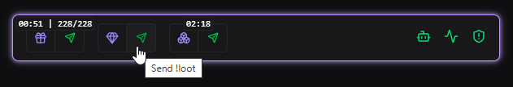
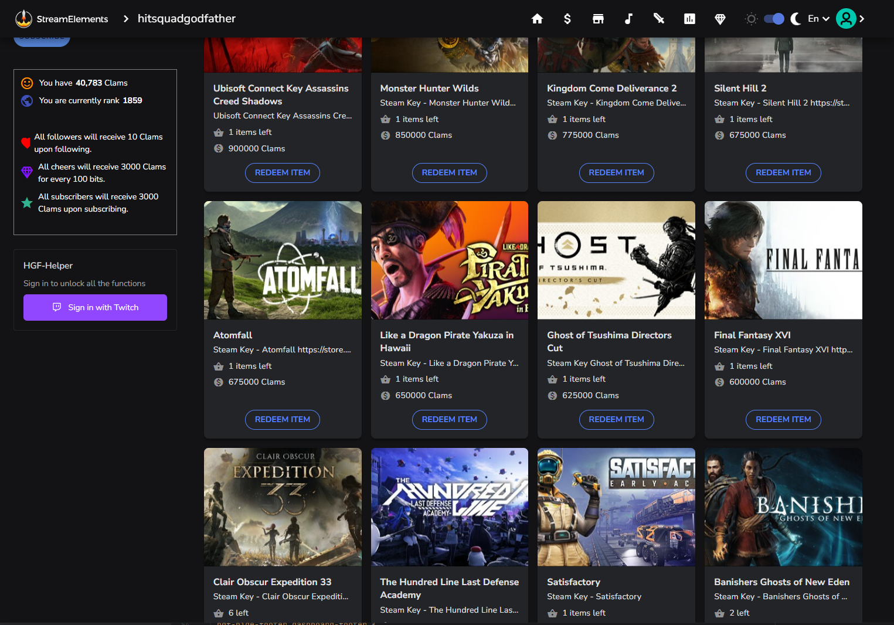
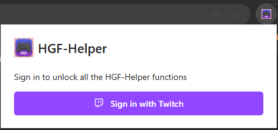
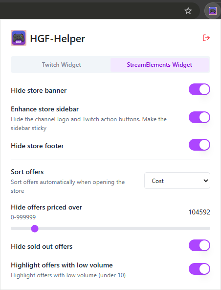

# HGF-Helper

❗ This README describes **version 2** of the extension.  
If you're looking for the README of version 1, you can find it [here](./readme/v1/README.md).  

To upgrade to the latest version, see the [Update instructions](#-update).

## 📘 Overview
A Chrome extension that adds automation and smart enhancements for the `.tv/hitsquadgodfather`, `.tv/hitsquadbruno`, `.tv/hitsquadvito` and `.tv/hitsquadcarlo` channels, as well as the Stream Elements game store.

## 🆕 What's New in Version 2

Here’s what’s changed compared to version 1:

1. 🔐 **Twitch-based authentication**  
   Extension features now use Twitch login for access.  
   This allows you to instantly access your personal settings from any browser — with just one click.  
   See [Privacy details](./readme/PRIVACY.md) for more information.

2. 🗃️ **No more JSONBin setup**  
   A JSONBin account is no longer required to store hidden offers.  
   The extension now handles data storage for you automatically.

3. 🧠 **Bot failure detection**  
    The extension now monitors the status of the mini-games bot and automatically pauses participation if the bot is not responding.

4. 🎨 **Complete UI redesign**  
   The entire extension has been visually refreshed.  
   The new interface is compatible with both light and dark themes on Twitch and StreamElements, and it automatically adapts to the current site theme.

5. 🧩 **Updated extension icon**  
   The browser action icon has been modernized to better fit the new look.

6. 🛠️ **Major codebase refactor**  
   Many internal modules have been restructured and cleaned up for better maintainability and performance.

   
### 🎮 Twitch Helper

This extension adds a widget to the stream page that allows you to play mini-games in a semi-automated mode.  
Its main features include:

1. ✅ **Auto-command sending**  
   Automatically sends `!hitsquad`, `!loot1-8`, and `!chest1-8` commands to the chat when the relevant toggles are turned on.

2. 🎯 **Quick manual buttons**  
   Provides clickable buttons for manually sending the `!hitsquad`, `!loot1-8`, and `!chest1-8` commands.

3. 🛡️ **Anti-cheat detection**  
   Detects when the anti-cheat screen appears and reacts accordingly based on the current anti-cheat version.

4. 🧠 **Bot status monitor**  
   Automatically detects if the mini-games bot is down and temporarily pauses participation.

5. ⏩ **Stream delay remover**  
   Removes the stream delay to ensure real-time interaction *(customizable via the settings popup)*.

6. 🎁 **Channel point collector**  
   Automatically collects available channel points during the stream *(customizable via the settings popup)*.

7. 🔁 **Stream recovery**  
   Automatically refreshes the stream page if video issues are detected.

8. 📺 **Ad-resilient**  
   All features continue to work even while ads are playing.

####  🛡️ Anti-Cheat Versions
The extension has supported several anti-cheat mechanics over time:
- Prohibited sending commands during the anti-cheat screen — **removed on 27 Feb 2025**
- Required sending the `!anticheat` command during the anti-cheat screen — **removed on 08 Jun 2025**
- Prohibits sending commands during the anti-cheat screen (handled automatically) — **active**

The appearance of the widget is shown in the images below:

### 🛍️ StreamElements Helper

The widget mounts on the game store page and adds several useful enhancements:
1. 👁️‍🗨️ **Hide unwanted offers**  
   Adds a button to each offer card that allows you to hide the offer.

2. 🛠️ **Manage hidden offers**  
   Lets you view and restore hidden offers directly from the store page.

3. 🔗 **Steam link integration**  
   Adds a link to each game's Steam page for quick access.

4. 🧹 **Automatic sorting**  
   Automatically sorts offers when the page loads *(customizable via the settings popup)*.

5. 💰 **Price filter**  
   Adds an option to hide offers above a specified price *(customizable via the settings popup)*.

6. 📉 **Low-volume highlights**  
   Highlights offers with low purchase volume *(customizable via the settings popup)*.

7. ✂️ **UI cleanup**  
   Removes redundant elements from the header, sidebar, and footer *(customizable via the settings popup)*.

The appearance of the widget is shown in the images below:

### ⚙️ Settings Popup

Provides access to global extension settings, allowing users to customize behavior across all supported pages.

The appearance of the popup is shown in the images below:

## 🧩 Installation

1. Download the latest release (`hgf-helper@vX.Y.Z.zip`) from the [releases page](https://github.com/v3il/hgf-helper/releases).
2. Unzip the archive to any directory.
3. Open the Chrome extensions page: [chrome://extensions/](chrome://extensions/).
4. Enable **Developer mode** (toggle in the top right corner).
5. Click **"Load unpacked"**, then select the directory where you extracted the extension.
6. *(Optional)* Open the **Settings Popup** to adjust extension preferences.

## 🔄 Update

1. Download the latest release (`hgf-helper@vX.Y.Z.zip`) from the [releases page](https://github.com/v3il/hgf-helper/releases).
2. Unzip the archive to any directory.
3. Copy **all files** from the new version into the directory of the currently installed extension, confirming file replacement.
4. Open [chrome://extensions/](chrome://extensions/) and click the **"Update"** button to reload the extension.

## ⚠️ Disclaimer

This extension was built to make participating in mini-games more convenient for individual users.  
It’s not intended for abuse, large-scale automation, or use with alt accounts.  

> The channel owner has stated that scripts are not allowed. Use at your own risk!

> The extension does **not interfere with ad revenue** — the user remains physically present on the stream, and all ads are displayed as usual.

The author of the extension takes no responsibility for any bans, timeouts, or consequences resulting from its use.
