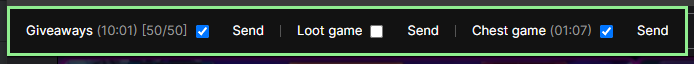
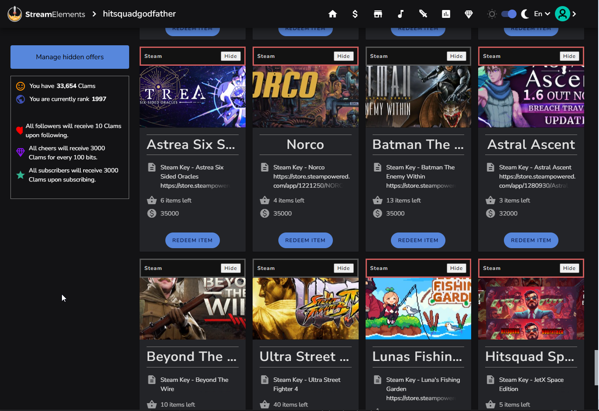
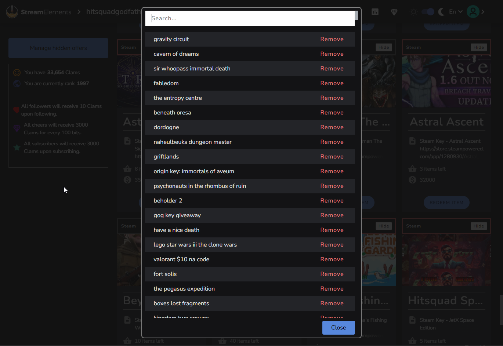
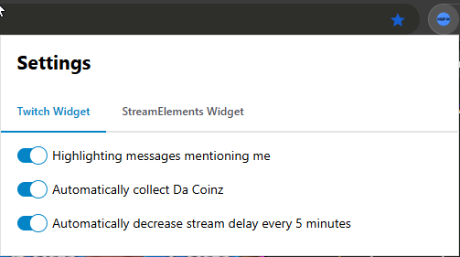
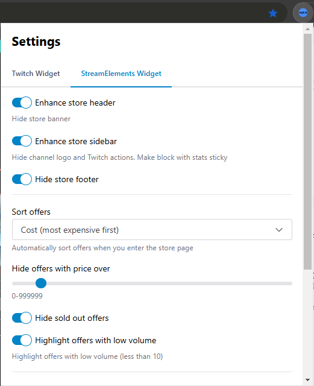

# HGF helper

## Overview
A Chrome extension that adds automation and smart enhancements for the `.tv/hitsquadgodfather` and `.tv/hitsquadplays` channels, as well as their StreamElements game store.

### Twitch helper

A widget is placed on the stream page that allows you to play mini-games in semi-automatic mode. The main functions of the widget are:
1. automatically sends the `!hitsquad`, `!loot1-8`, `!chest1-8` commands to the chat if corresponding checkboxes are enabled;
1. provides buttons to easily send the `!hitsquad`, `!loot1-8`, `!chest1-8` commands in manual mode;
1. automatically generates a question for Akira's drawing if the corresponding checkbox is checked [*currently removed*];
1. automatically handles the anti-cheat screen;
1. automatically removes the delay on the stream every 5 minutes;
1. automatically collects channel points;
1. automatically refresh the stream page if there are problems with the video;
1. all features keep working while showing an ads;

#### Anti-cheat versions:
- Prohibits sending commands during the anti-cheat screen **[removed on 27 Feb 2025]**
- Requires sending the `!anticheat' command during the anti-cheat screen **[removed on 08 Jun 2025]**
- Prohibits sending commands during the anti-cheat screen - handled automatically **[active]**

The appearance of the widget is shown in the image below:

### StreamElements helper
The widget mounts on the store page and adds several useful features:
1. adds a button to the offers that allows you to hide the offer (requires JSONBin account);
2. adds the ability to manage hidden offers directly from the store page;
1. automatically sorts offers when you enter the page (can be configured in the settings popup);
1. adds a link to the game's Steam page;
1. adds the ability to hide offers above a certain price (can be configured in the settings popup);
1. highlight offers with low volume (can be configured in the settings popup);
2. removes redundant elements from the header, sidebar and footer (can be configured in the settings popup);

The appearance of the widget is shown in the image below:

**Important information**: To have the ability to hide offers, you need to create a [JSONBin](https://jsonbin.io/) account, create a new bin and fill in the appropriate settings in the settings popup (your credentials will not be shared).

### Settings Popup
Allows user to change global settings for the extension.

Twitch helper settings: \

StreamElements helper settings: \

## Installation
1. Download the latest release (hgf-helper<area>@v1.x.y.zip) from the [releases page](https://github.com/v3il/hgf-helper/releases);
2. Unzip the archive to any directory;
3. Go to the extensions page in the Chrome browser [chrome://extensions/](chrome://extensions/);
4. Turn on developer mode;
5. Click the "**Download unpacked extension**" button, specifying the path to the unpacked extension.
6. **[optional]** Adjust the extension settings in the settings popup.

## Update
1. Download the latest release (hgf-helper<area>@v1.x.y.zip) from the [releases page](https://github.com/v3il/hgf-helper/releases);
2. Extract the archive to any directory;
3. Copy all the files of the new version of the extension into the directory of the old version, confirming the replacement of the files;
4. On the extensions page [chrome://extensions/](chrome://extensions/), click the "Update extensions" button.

## Disclaimer
**The software was made to automate participation in mini-games on the channel and not to abuse. 
It might stop working properly at any time with a new overlay update, use it at your own risk. \
The author of the extension doesn't support account farms in any form and isn't responsible for any timeouts received.**
